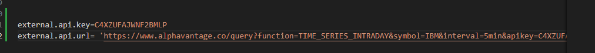
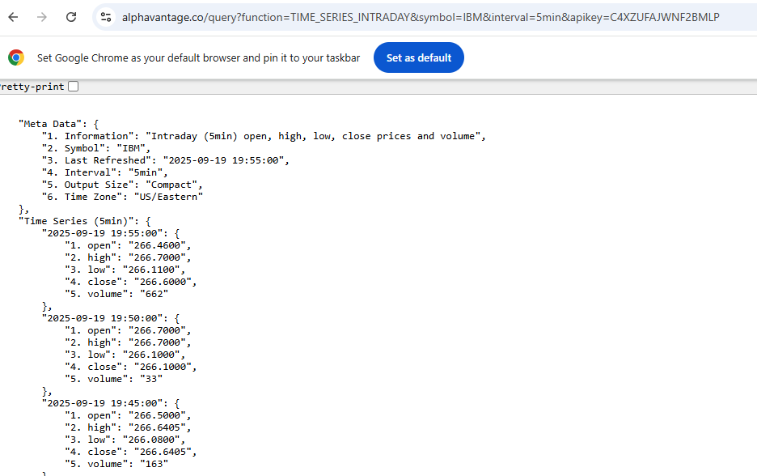
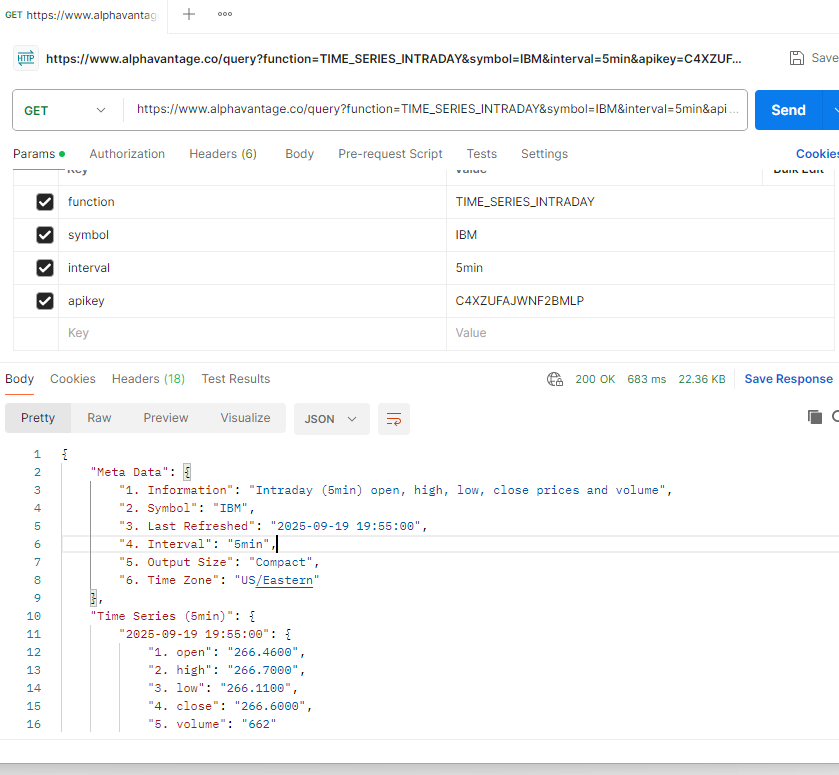
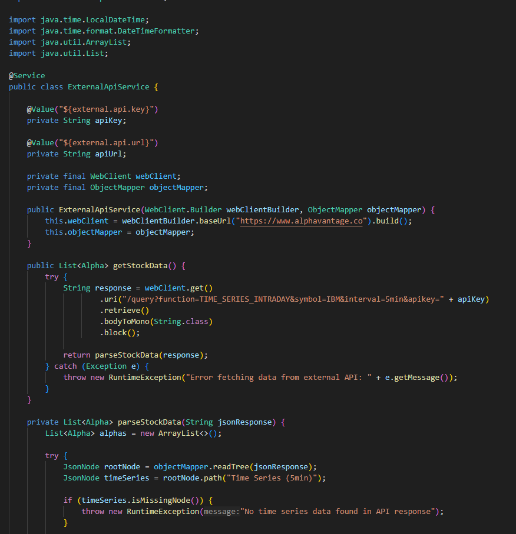

### Escuela Colombiana de Ingeniería
----
### Arquitecturas de Software

----
#### Parcial primer corte
----

#### Juan David Zambrano Gonzalez

----
### **1. Creamos la estructura del proyecto con Spring Initializr**

**Luego dentro del proyecto creamos los paquetes de (controllers, models, repository, services)**

**AlphaControllers**

**Alpha**

**AlphaRepository**

**AlphaServices**

### 2. Hacemos **mvn clean package**

Y **mvn spring-boot:run**
    

    Luego verificamos en **Postman** que este corriendo con (http://localhost:8080/api/alphas)
    

### 3. Despliegue en **Azure Devops**    

**En este caso usaremos la extension de *Azure Tools***

- Creamos un nuevo **App Services**

        

- Lo configuramos y esperamos a que se cree el servicio

    

- Una vez creado el servicio, hacemos el **Deploy to web app**

    

    

- Hacemos la configuracion para CI/CD

    
    
    

- Hacemos el .github\ workflows y esperamos a que haga build y deploy

    

- Hacemos una prueba momentanea con un controller test, para verificar que se desplego correctamente

       

- Configuramos la API externa con la API Key otorgada
    

- Realizamos pruebas de consulta en web y en Postman y obtenemos resultados 
    

    

    - Clase API externa

    

